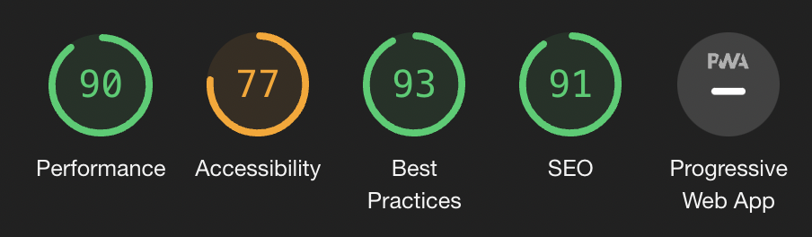
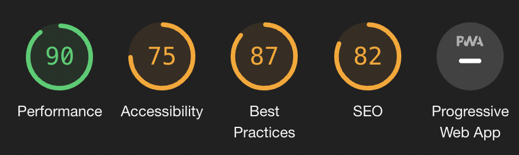
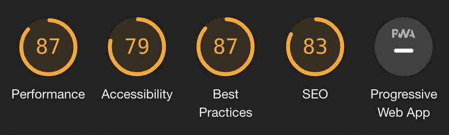
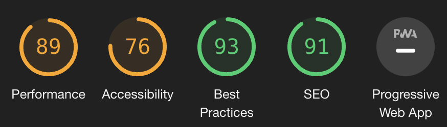
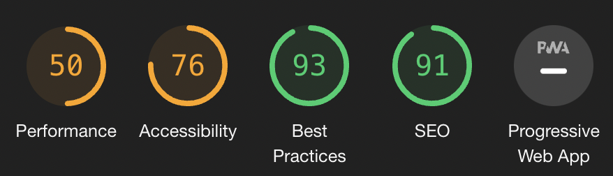
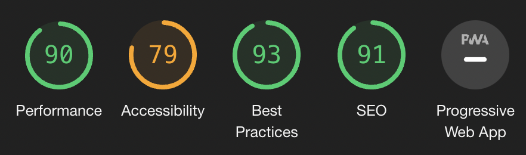
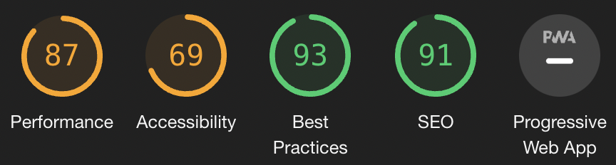

## Tests from Validators

#### [HTML Validation](https://validator.w3.org/nu/#textarea)

- There are a few errors in HTML validation because of use of django

#### [CSS Validation](https://jigsaw.w3.org/css-validator/validator)

- CSS Validation passed with no errors
- 

#### [Javascript Validation](https://jshint.com/)

- No errors but a few warnings

#### [Python Validation](http://pep8online.com/)

- A few warnings from auto generated files

#### Lighthouse

- Home Page
    
    

- About
    
    

- Products page
    
    

- Login Page
    
    

- Register Page
    
    

- Subscribe Page
    
    

- Adding product
    
    

## Testing User Stories

#### Shopper
- User can view list of all products
- User can look into individual products
- User can easily view the total items in the bag
- User can sort the products by price, category name and rating
- User can search for a product
- Yser can easily see the number of search results
- User can easily select the quantity of an item being purchased
- User can easily find the items in the bag
- User can adjust the qunatity of the. items in their bag.
- User can easily see their payment information
- User can view their order details and checkout

#### Site User
- As a site user I can easiy register for an account
- As a site user I can log in and log out
- As a site user I can easily register for the newsletter
- A site user cam easily have a personlised user profile with my order history
- As a site user, I can get emails after registering
- As a site user, I can recover password if forgotten

#### Store Owner
- As store owner you can easily add products
- As store owner you can easily edit products
- As store owner you can easily delete products

